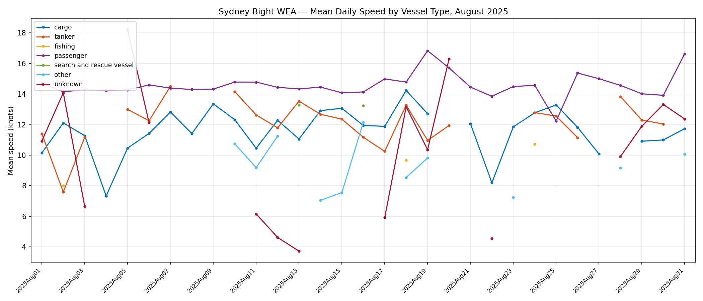
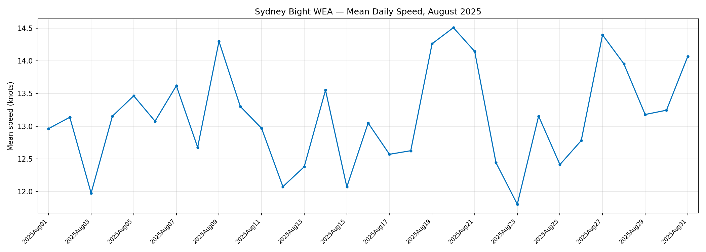
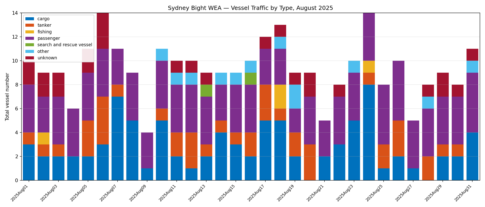
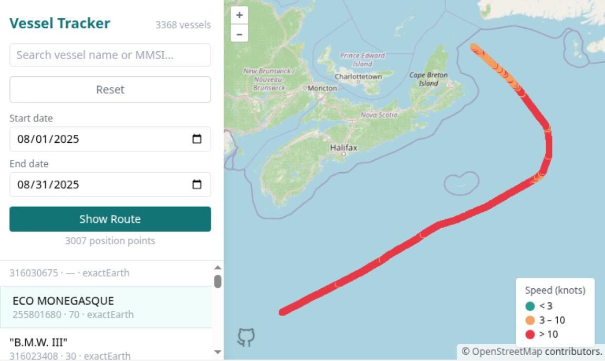

# June 9, 2026

## Analysis of vessels, Sydney Bight

### 1. Statistics with vessel type, number, speed

**Separated by vessel type**

*Mean daily speed in knots for each vessel type inside Sydney Bight WEA. Gaps indicate no vessels of that type were detected on that day.*

**All vessels together**

*Mean daily speed across all vessel types combined. Provides a cleaner overall trend without per-type breakdown.*

### 2. Plot of August 2025 statistics as function of the day

*Daily unique vessel counts inside Sydney Bight WEA, stacked by vessel type. Shows traffic volume and composition throughout August 2025.*

---

## Ingestion

- Unzipped CSV files in `/mnt/echowind/csa_ais/csa_satellite_ais_2025_11_17/SAISData/CSV/old/2025/08`
- Took ~7h to run the ingestion script by transferring August 2025 CSV files via SSHFS (June 8 21:31 to June 9 04:25 local time)
- Estimated it would take ~1h over a direct access to echowind
- Parsed 744 CSV files (plus one test.csv which is a copy of the first day, deduplicated the data afterwards) inside aug

## Results

- 4,498,747 points plotted
- Initially loaded 4,182 unique MMSI, filtered for MMSI between 200000000 - 799999999 leaving 3368 vessels displayed in the UI
- Now when Docker is running (setup instructions in README), anyone on the DFO server can access the user interface on [http://142.2.83.73](http://142.2.83.73) - likely the same architecture we will use for the final project
- When you open the UI, you should see all 3368 vessels loaded in, and be able to select them to see their tracks from 08/01/25 to 08/31/25.

## Next Steps

- Look into: How the data is stored inside PostgresSQL database, sizes of everything and loading times to measure efficiency, analyze the usages of DuckDB and TimescaleDB to see how much they actually improve speed for large datasets
- Design choices: What to do with remaining buoys and Unknown vessels?
