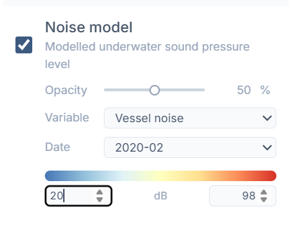
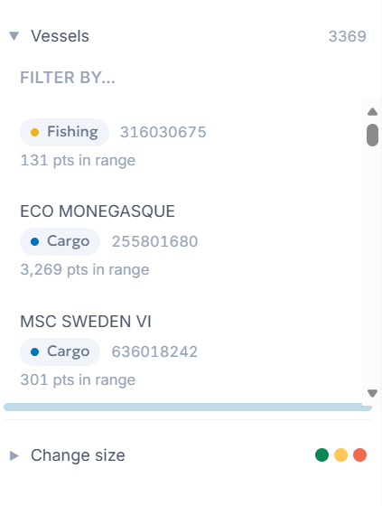

# July 13th, 2026

Feature updates from today.

## Adjustable noise colour scale

Min/max noise dB range is now user-editable.

How it works:
- GeoTIFF file does not have colour scales pre-defined, they are inputted when generating a PNG overlay using Matplotlib. This makes it easy to allow custom scales and change the visual accordingly.

## Resizable, collapsible vessel list

The vessel list is collapsable, and all panel lists are resizeable by dragging the handle below it. This way, 

## In progress:
User input depth for noise model layer.
