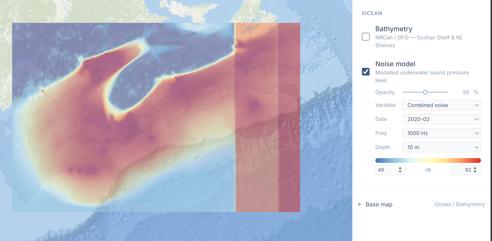

# Feb 2020 noise map error

**Data issue**: `20200223.nc`, timestep 70 (one
10-min window from that day), reports a huge chunk of the map (east of ~61.4°W,
all depths) at the exact same noise value regardless of depth. These identical values seems to be a data mistake. 

**Code issue**: The conversion script's monthly averaging
converts dB to linear scale before averaging has no upper-bound check.
The glitched reading (154+ dB) became ~100x louder than normal in the math, letting 1 bad reading out of 4,176 overtake the whole month's average for every
location.

**Result**: each day's file looks fine; the monthly file doesn't, because
 the one bad reading gets blown up instead of averaged out.

**Fix**: added a sanity cap (drop implausibly high readings, like `0 dB`
is already dropped) before the linear averaging step. Regenerating Feb
2020 now (all 95 combinations with combined noise).
