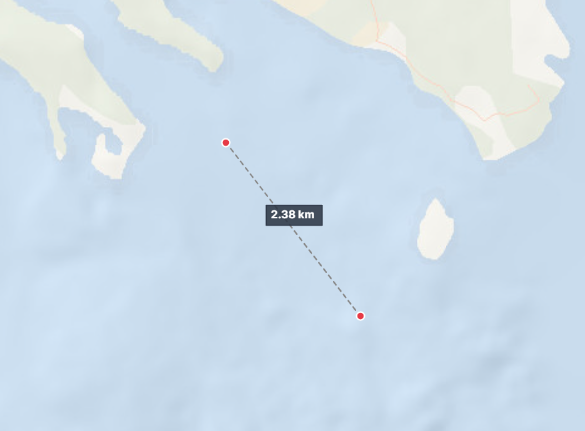
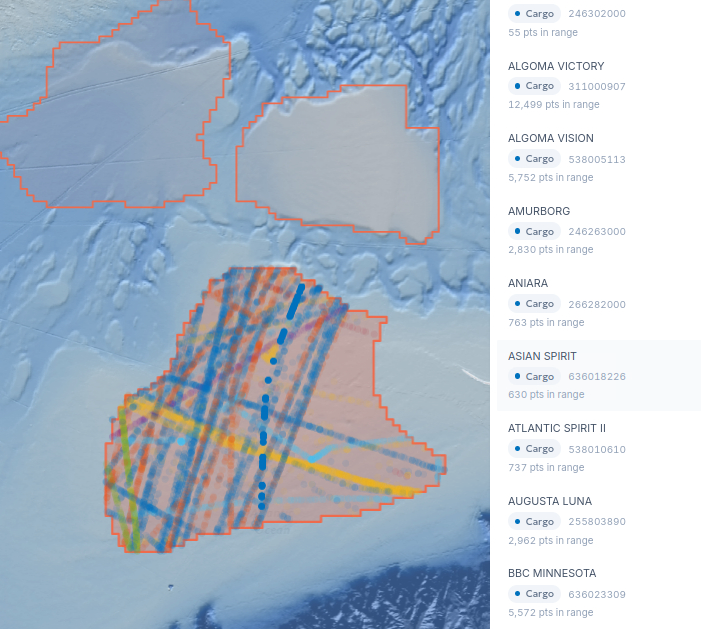
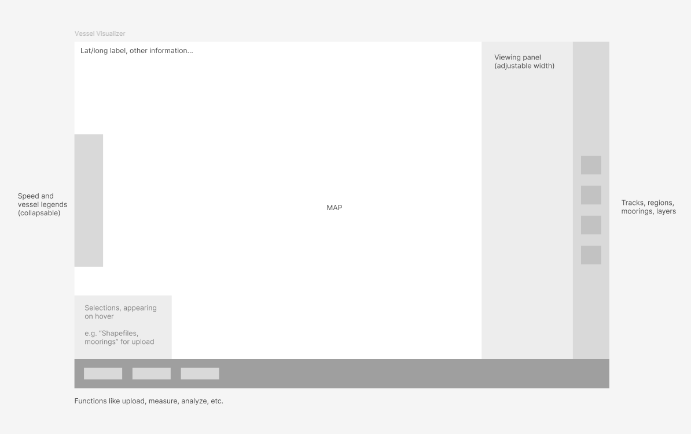

# July 9th, 2026

Feature updates from today.

## Bug fixes

- Drawn region outlines could get stuck on the map after toggling the sidebar or drawing a new region — fixed.

## Features

### Measure distance between two points, anywhere on the map

Could add:
- More information after measuring, if needed
- Allow user to change units in settings

### Show all vessel traffic in a region with different colours

Hovering over the name of a vessel in the side panel focuses that vessel.
Unselect the region to clear the traffic view.

## Idea — looking for feedback: bottom navigation bar

Thinking of adding a navigation bar at the bottom for persistent tools, instead of the current stray button in the bottom left corner.

Functions like uploading files and adjusting sizes of points could move to the bottom navigation bar, keeping the side panels solely for viewing features.
